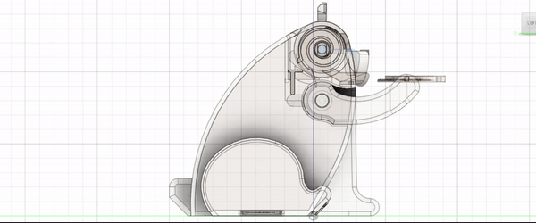

# Final Project - Bear Coin Bank
For my final project I've chosen to design a coin bank in the shape of a bear. The coins are inserted via a tray in the bear's hand, which then slide into the now-opened mouth after rotating the head. I have chosen to work on this design because of both it's usefulness in daily life and it's endearing appearance.

### How it works

The mechanism can be divided into the following main components:
   - body
   - arms & tray
   - head
   - eyes & jaw
   - bottom cap
   - bolts & springs

The following are the joints active during the motion:
   - Revolute joint between the bottom cap and the body
   - Revolute joint between the head and the body
   - Slider joint between the slider component and the body
   - Revolute joint between the arm and the body
   - The arm and the tray, alongside the head and it's bolts are bound in rigid groups

These joints are bound with 2 motion links:
   - between the head's rotation and the slider's movement
   - between the slider's movement and the arm's rotation

Rotating the head pushes down on the small slider, leading to the opening of the mouth and the upper rotation of the arm & tray, which causes the coin situated on the tray to fall inside the coin bank, which can be later retrieved by opening the cap situated on the bottom of the mechanism.

The main motion of the mechanism can be visualised by powering the head revolute joint or by watching the main motion study.

### Renders

https://user-images.githubusercontent.com/38106401/119275553-756c3a80-bc1e-11eb-8108-41d5ad7abc8a.mp4

https://user-images.githubusercontent.com/38106401/119275563-8157fc80-bc1e-11eb-98e9-be7c9d0152d7.mp4

### Files
   - gifs
      - contains the mechanism showcase gif
   - hdr
      - contains the HDR used in the making of the showcase (Source: https://hdrihaven.com/hdri/?h=childrens_hospital)
   - renders
      - contains the rendered images & videos of the project
   - stls
      - contains the STLs of the components of the mechanism
   - Final Project - Bear Coin Bank.f3d
      - .f3d of the project

### Software used
The entirety of the project, including the renders, has been built using the Fusion 360 application by Autodesk.
The mechanism showcase was recorded using OBS.

### Credits
The mechanism is based on the one built by [erwoong](https://www.thingiverse.com/erwoong/designs)
Original mechanism:
Thingiverse - https://www.thingiverse.com/thing:4809969
Youtube - https://www.youtube.com/watch?v=njh3S9VZ788

### Checkpoints
1. Checkpoint 1
   - Choosing the mechanism for the final project; dividing into components.
2. Checkpoint 2
   - Added the bear's body and bottom cap
3. Checkpoint 3
   - Added the hand, head and joints
4. Final deadline
   - Finished the head
   - Added the jaws and eyes.
   - Rendered the mechanism and finished the README.
