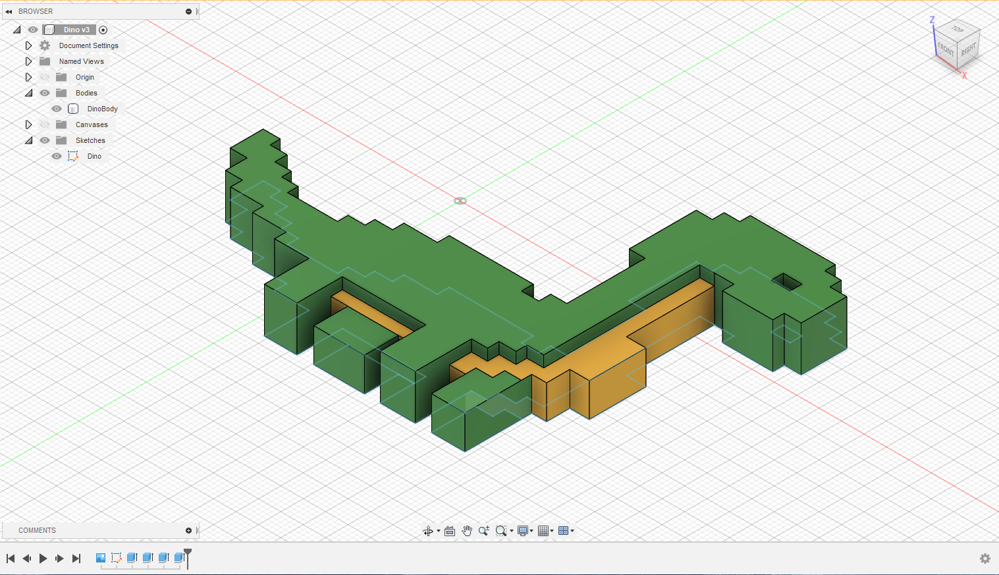

# 3DMP - Homework 1
 

* Soft deadline: 07.03.2021 | 23:59:59
* Hard deadline: 10.03.2021 | 23:59:59 (50% of the grade) 
* Tasks:
  1. Install Fusion 360 on your laptop
  2. Create an Autodesk student account and log yourself in using Fusion 360 on your laptop
  3. Install Prusa Slicer on your laptop
  4. Create a 3D pixel art style keychain. By starting from a 2D sketch you need to fit those specific dimensions: 10 cm (X) x 7 cm (Y) x 1 cm (Z)
  5. Slice the model in Prusa Slicer
  6. Push the homework on GitHub

