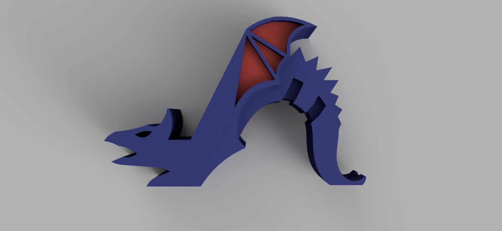
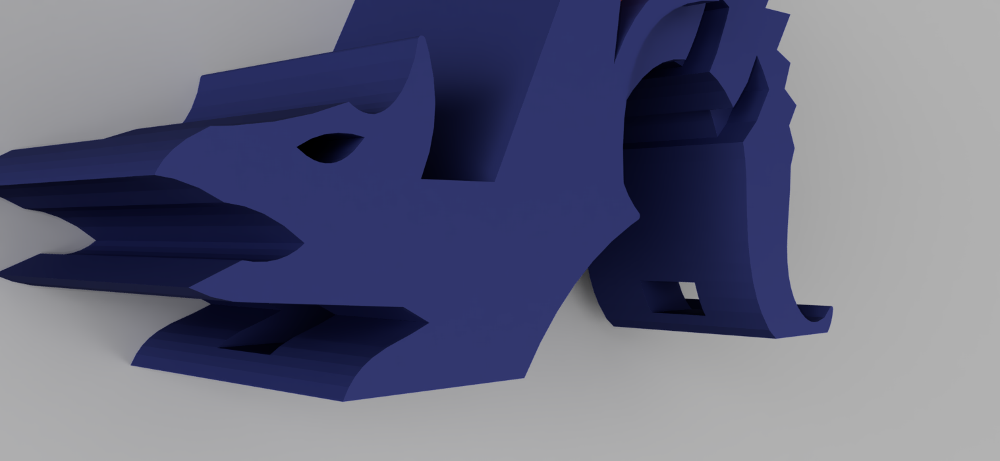

# 3DMP - Homework 2 - Thingiverse DragonPhoneHolder
 

I have chosen to remix a dragon-shaped phone stand (https://www.thingiverse.com/thing:1702891) that did not allow the users to charge their phone while on the stand. I have added a few holes that will allow users to insert a charging cable, allowing for the use of the phone on the stand as long as necessary.

My remix can be found here: https://www.thingiverse.com/thing:4785495

