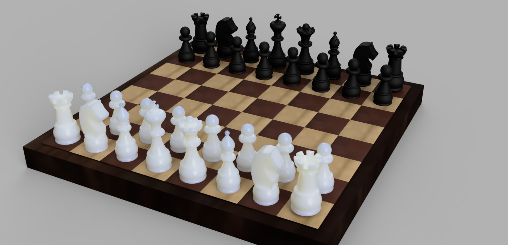

# 3DMP - Homework 3
 

* Hard deadline:  24.03.2021 | 23:59:59
* Tasks:
  1. Turn on capture history (the homework will not be graded if capture history is not turned on).
  2. Import an SVG (link here) and design a chess pieces set: 
     * 1 pawn, 
     * 1 knight, 
     * 1 bishop, 
     * 1 rook, 
     * 1 queen,
     * 1 king.
  3. Use the SVG sketch to revolve the pieces: 
     * You need to take care when designing the knight; only the base should be revolved; find another solution for the horse part e.g: extrusion, fillet, etc.
     * When designing the bishop, revolve the part that doesn’t have the slit, and add the slit after.
  4. When using revolve, you need two things: the profile and the axis:
     * For the profile, you will use half of the chess piece 
     * For the axis, you will use a line that cuts the piece in half. 
     * You need to add this line by yourself, editing the SVG sketch using constraints (don’t add it using a new sketch, it needs to be in the same sketch for the revolve to work).
  5. Use a circular pattern to add details on the top, neck and base of the pieces.
  6. The SVG is a little bit stylized. The chess pieces contain smaller parts that are not connected. For the full grade, you need to find a way to make each chess piece only one body! 
  7. Slice all the pieces in PrusaSlicer. 
	* BONUS: Make the board as well. Multiply the pieces and align them on the board. Add appearance (videos about appearance can be found in the course).

 

## Table of contents
  This folder contains:
  1. The f3d file for the chess pieces set Fusion project;
  2. The STLs folder containing the STL of each individual chess piece;
  3. The Sliced Images folder containing all the images of the sliced chess pieces from PrusaSlicer;
  4. The bonus chess board project.