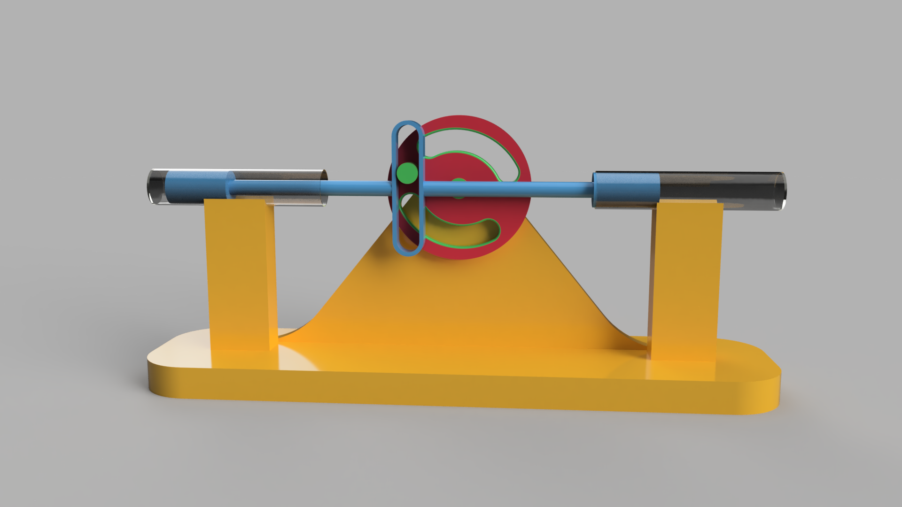
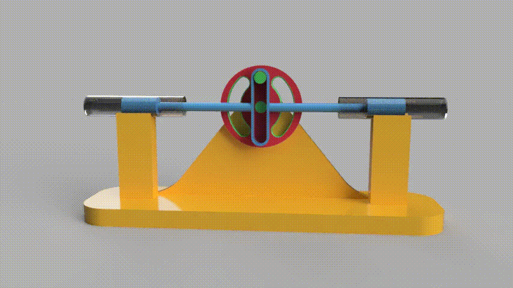
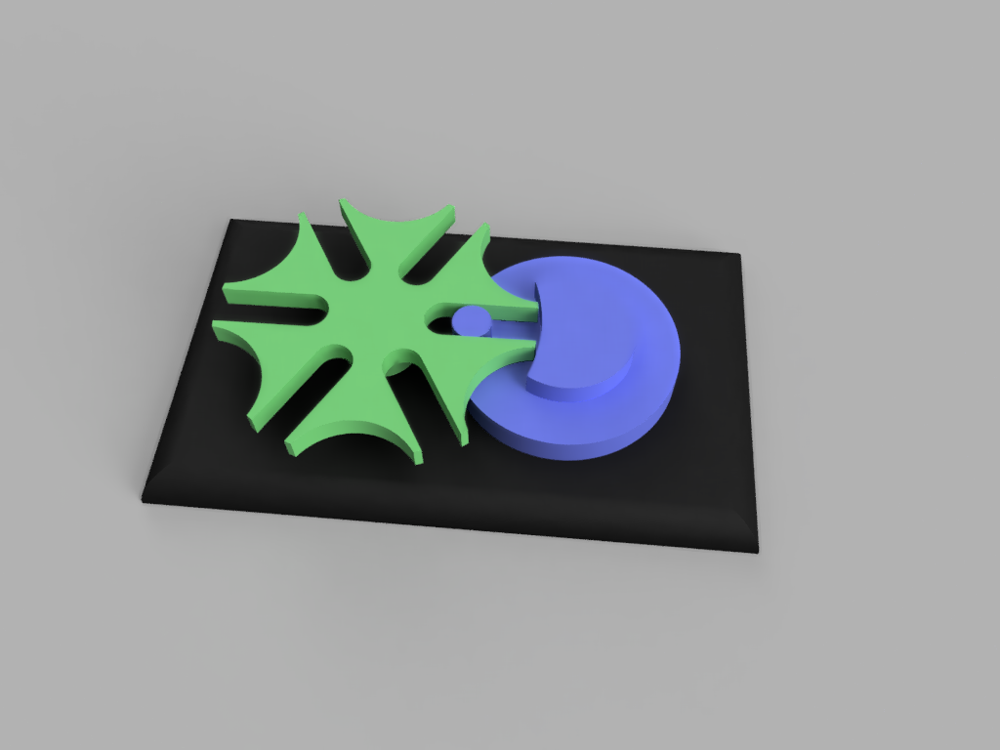
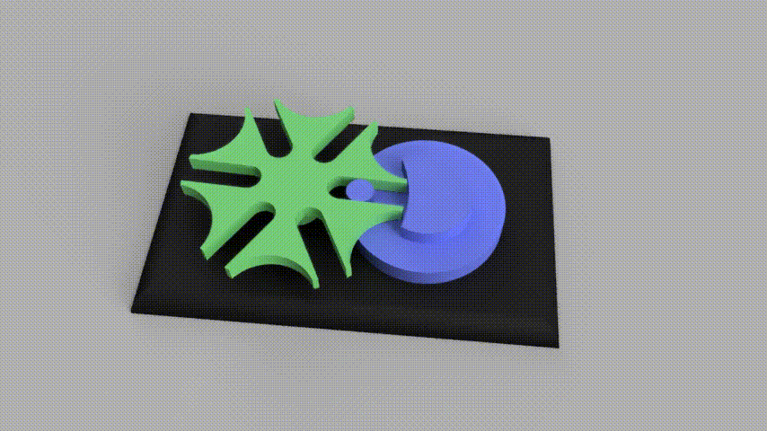

# 3DMP - Homework 4
 

1. Watch and understand the courses videos about Rotational to Linear Motion and Vice-Versa mechanisms (Bonus: we recommend to model them on your own as well)
2. Design the Scotch Yoke Mechanism taking the course videos as reference (especially the slider crank mechanism; in this one can see why it’s important to use Fusion Rule Number 1)
3. Choose ONE mechanism from the next list and design it in Fusion:
   * https://tinyurl.com/y8zgkzjq
   * https://tinyurl.com/ycxhnskp
   * https://tinyurl.com/ycc3mrls
   * https://tinyurl.com/ybxq84ko
   * https://tinyurl.com/y9uww3b8
   * https://tinyurl.com/y94sx6om
   * https://tinyurl.com/y7jvyma3
   * https://tinyurl.com/ydabljd6
Requirements for 2 and 3:
* Divide the mechanism into components
* Use Fusion Rule Number 1
* Design the model having in mind that it will be 3D printed (Create a stand for the mechanism - like “Holder” component made in Course 5 videos - so they will not levitate)
* Use suggestive names for your bodies, components, sketches, joints, contact points, construction planes or any element that you include in your project
* Add appearances
* Add joints
* Create a motion study
* Render the mechanism (upload a rendering photo to GitHub as well)
OBS: Turn on capture history (the homework will not be graded if capture history is not turned on). You need to upload the project as .f3d and a .stl for each projects’ body and component.
BONUS:  Make a video rendering with the mechanism displaying the motion study. Use the result to make a video tutorial where you present how the mechanism is working.

 

## Table of contents
  This folder contains the F3D, STLs, images and GIF for:
  1. First mechanism - Scotch Yoke Mechanism (reference: https://www.youtube.com/watch?v=HhX-8RyP214)
  
  
  2. Second Mechanism (reference: https://tinyurl.com/y94sx6om)
  
  
  